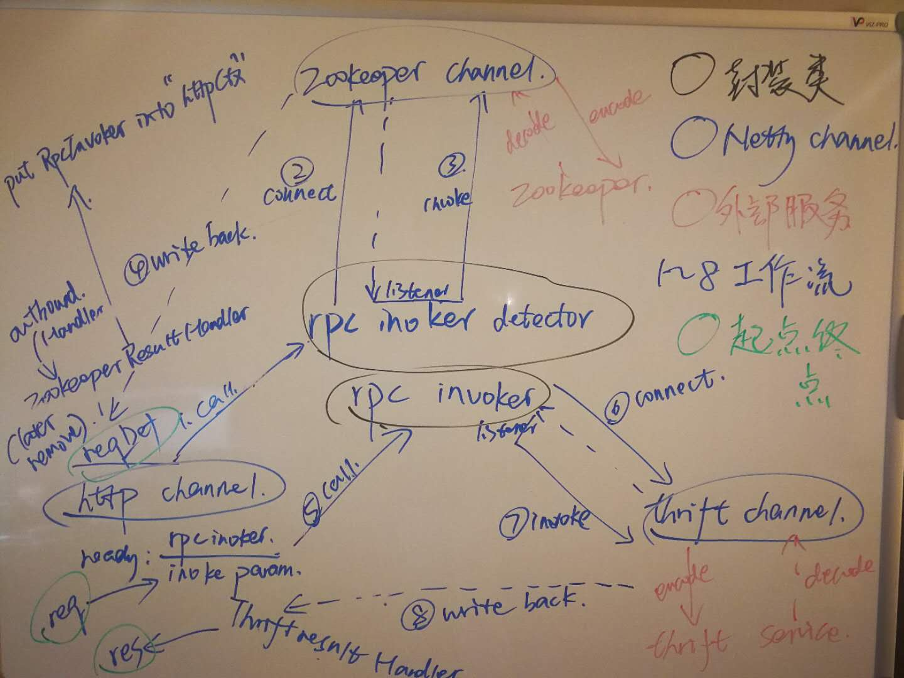

# 基于Netty的服务网关 （未完成）

## 依赖
* Netty: 4.1.19Final
* Thrift: 0.10.0

## 架构
Netty基于事件驱动，底层用multiplexing实现NIO。一个EventLoop对应一个线程，并负责处理多个Channel。

网关接受http客户端发出的http请求，通过service discovery找到下游服务并转换对应的rpc请求发送给下游服务。rpc响应收到后，转换成http返回给客户端。

一个acceptor线程负责监听客户端请求，工作线程提供两种模式：

1. Http请求用**一个线程池**(EventLoopGroup), RPC请求用**一个线程池**. 这里考虑到可能可以复用和下游服务的连接，所以提供这种模式。（还没想明白，暂时没有复用连接）
2. Http请求和RPC请求**共用一个线程池**。这种模式的一个好处是可以把对应的http channel和RPC channel放在同一个线程当中，在一个请求的生命周期中减少了很多上下文切换。实验时能明显感觉到相比上一个模式延迟确实有明显的降低（以后还需要在高负载情况下benchmark）。采用这种模式的时候，项目默认把RPC channel和Http channel放在同一个线程。

路由可配置，使得网关能自动根据收到的http请求找到对应的下游服务和对应的数据转换器。

数据转换器：这个模块项目提供接口，根据具体业务逻辑实现。在路由配置中设置好对应的转换器类名，项目通过反射机制自动导入。

设计目标是下游服务可以采用各种协议。当前的可运行样例主要基于Thrift实现，Protocol采用TCompactProtocol，Transport因为要基于NIO，只能用TFramedTransport。服务发现也可以采用各种机制。

设计目标是把所有的IO全部用事件驱动解决，包括服务发现（这个部分还未完成）

加上service discovery的设计图如下，服务发现基于zookeeper（开发中）：

## 工作流
1. **请求路由和服务发现** 接受客户端http请求，通过配置好的路由信息启动路由，找到http请求定义`HttpRequestDef`在路由中找到对应的下游服务信息`RpcInvokerDef`：rpc协议，服务名，方法名，数据转换器。 然后通过服务发现获取服务地址等其他信息，创建`RpcInvoker`实例。
2. **Http请求转换成RPC参数** 这个部分由业务逻辑决定，继承 `FullHttpRequestParser` 实现无状态的转换器。在`HttpParamConvertor`中被调用。
3. **连接下游服务，创建RPC channel** `RpcInvoker.connectAsync()`
4. **序列化RPC请求** `ThriftEncoder`
5. **反序列化RPC响应** `ThriftDecoder
6. **写回Http channel**  `RpcFinalHandler`
7. **RPC结果转换成Http响应** 这个部分也有业务逻辑决定，继承`FullHttpResponseGenerator` 实现，在`ResultHttpConvertor`中被调用。

## 运行
1. 启动`examples.thrift_service.ThriftEchoServer` 端口hardcode为9090
2. 启动`sgw.NettyGatewayServer`  默认绑定8080端口，目前service discovery是hardcode的，直接会连接到localhosst:9090
3. http客户端POST http://localhost:8080/aaa 请求体附上一端字符串string
4. http响应体："This is return result: " + string

